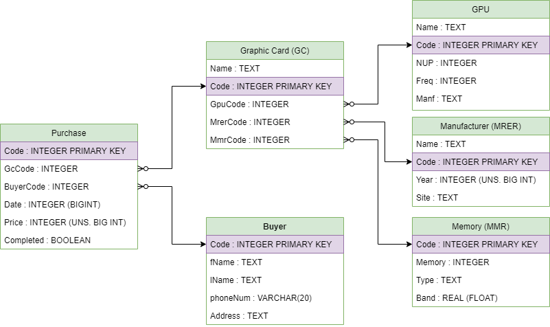

# Графический интерфейс с использованием PySide
Данный проект представляет из себя тестовое приложение с графическим интерфейсом написанное на Python3 с использованием библиотеки PySide и бд SQLite  
***
Ниже представлена ER Диаграмма: 
  
***
Ниже представлена UML Диаграмма: 
  